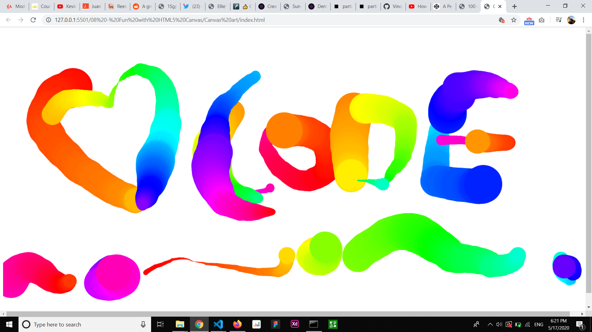

# canvas-art
This was a fun project to interact with the canvas.
Got to learn a lot about different methods and properties that can make you adjust the canavas like:
 
<ul>
  <li>getContent('2d')</li>
  <li> lineJoin </li>
  <li>LineCap</li>
  <li>lineWidth</li>
  <li>beginPath()</li>
  <li>moveTo()</li>
  <li>lineTo()</li>
  <li>stroke()</li>
</ul>
 
 

